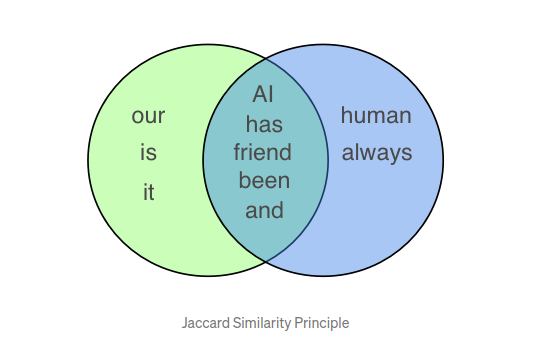
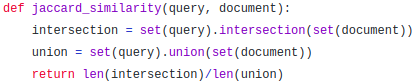
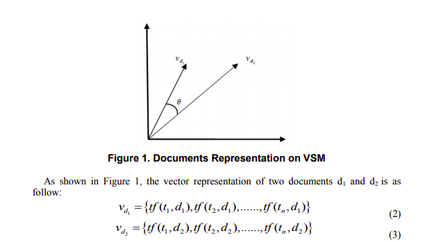
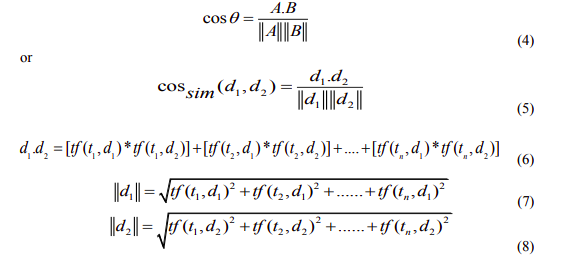
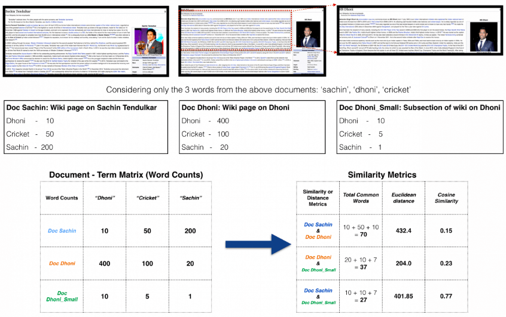
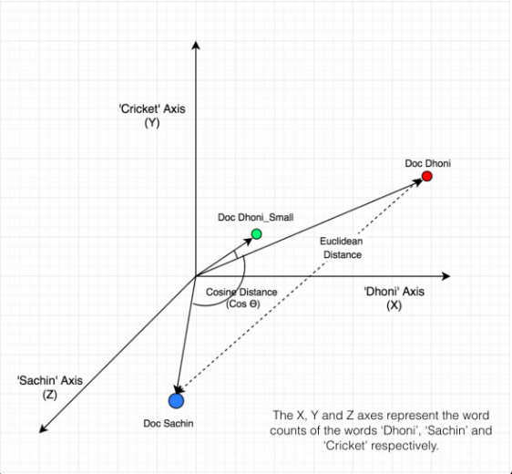

# Text Similarity
- **Similarity measurements** are very important concepts in text mining and information retrieval that helps to quantify similarity between documents, which is effective in the improvement of the performance of search engines and browsing techniques.
- There is always need to compute the similarity in meaning between texts.
    1. **Search Engines** need to model the relevance (appropriate) of a document to a query, beyond the overlap in words between the two.
        - For instance, **question-and-answer** sites such as Quora or stackoverflow need to determine whether a question has already been asked before.
    2. **In legal matters**, text similarity task allow to mitigate risks on a new contract, based on the assumption that if a new contract is similar to a existent one that has been proved to be resilient, the risk of this new contract being the cause of financial loss is minimised.
    3. **In customer services**, AI system should be able to understand semantically similar queries from users and provide a uniform response.
        - For example, if the user asks **What has happened to my delivery?** or **What is wrong with my shipping?**, the user will expect the same response.
- All the similarity measures map to the range of [-1, 1] or [0, 1]. The 0 or -1 represents minimal similarity, and 1 represents absolute similarity
- Text similarity has to determine how 'close' two piece of text are both in surface closeness (**lexical similarity**) and meaning (**semantic similarity**)
    - **lexical similarity** of 1 would mean a total overlap between vocabularies, whereas 0 means there are no common words.
    - **semantic similarity** between two text is based on the likeness of their meaning
- For instance, how similar are the phrases **the cat ate the mouse** with the **the mouse ate the cat food** by just looking at the words?
    - **On the surface**, if you consider only **word level similarity**, these two phrases appear very similar as 3 of the 4 unique words are an exact overlap. 
        - It typcally does not take into account the actual meaning behind words or the entire phrase in context.
    - Instead of doing a **word for word comparison**, we also need to pay attention to **context** in order to capture more of the **semantics**.
        - To consider **semantic similarity** we need to focus on **phrase/paragraph levels** (or lexical chain level) where piece of text is broken into a relevant group of related words prior to computing similarity. We know that while the words significantly overlap, these two phrases actually have different meaning
- There is a **dependency structure** in any sentences:
    > **mouse** is the object of **ate** in the first case and **food** is the object of **ate** in the second case
    - Since **differences in word order** often go hand in hand with **differences in meaning** (compare **the dog bites the man** with **the man bites the dog**), we'd like our sentence embeddings to be **sensitive to this variation**.
- **Word vectors** have evolved over the years **to know the differences** between the _record the play_ VS _play the record_

# How to Calculate Similarity
- The **big idea** is that you **represent documents as vectors of features**, and **compare documents by measuring the distance between these features.**
- There are **multiple ways** to **compute features** that captures the **semantic of documents** and multiple algorithm to capture **dependency structure of documents** to focus on meanings of documents.
- Supervised training can help sentence embeddings learn the meaning of a sentence more directly
- Popular ways of **computing sentence similarity** are:
    1. **Jaccard Similarity**
    2. **Cosine Similarity**
    3. **Knowledge-based Measures and soon**
- Here we mainly focus on:
    1. **Jaccard Similarity**
    2. **Cosine Similarity**
    

# Different Embeddings?
- Word Embeddings will be more clear in later task, but let's just know the basic
- Word embedding is one of the most popular representation of document vocabulary. It is capable of capturing context of a word in **document**, **semantic** and **syntatic similarity**, relation with other words, etc.
- **A list of different embeddings are:**
    - Bag of Words (BoW)
    - Term Frequency - Inverse Document Frequency (TF-IDF)
        - Continuous BoW (CBOW) model and SkipGram model embedding(SkipGram)
        - Pre-trained word embedding models : 
            >  Word2Vec (by Google)  
            >  GloVe (by Stanford)  
            >  fastText (by Facebook)  
        - Poincarré embedding
        - Node2Vec embedding based on Random Walk and Graph   

# 1.Jaccard Similarity
- Jaccard similarity or intersection over union is defined as **size of intersection divided by size of union of two sets**.
- **Example**
    - **Sentence 1:** _AI is our friend and it has been friendly_ 
    - **sentence 2:** _AI and human have always been friendly_  
    - 
    - In order to calulate similarity using **Jaccard Index**, Generally **lemmatization** is performed to reduce words to the same root word. Here, _friend_ and _friendly_ will both become _friend_, _has_ and _have_ will both become _has_ as we can also see from above figure.
    - From above sentence,
        - **size of intersection**=5
        - **size of union**=10
        - **jaccard index** = _size of intersection / size of union_ = 0.5
    - **Jaccard Index** ranges from 0 to 1
        - 0 indicates no common words between text
        - 1 indicates two sentence are identical
    - **Code snippet:**
        -  
- **Why Jaccard Similarity is not efficient?** 
    - Let us clarify with **example**
        - **Sentence 1:** President greets the press in Chicago
        - **Sentence 2:** Obama speaks in Illinois
        - Here above two sentences **have no common words** and will have **a Jaccard socre of 0**. This is a **terrible distance** score because **the 2 sentences have very similar meanings**.
        - Here **Jaccard similarity** is neither able to capture **semantic similarity** nor **lexical semantic** of these two sentences.
    - Also, as the **size of the document increases**, the number of common words tend to increase even if the documents talk about different topics

# Vector Space Model
- **Vector space model (VSM)**, helps us to convert the original string text within a document into a vector of numbers.
- In **VSM**, each document is considered as a vector in a vector space. 
- Assume **D = {d1, d2,..,dn}** is a dataset that has n number of documents and **T = {t1, t2,...,tn}** is a set of distinct terms/words, which occurs in D. Then the vector representation of document D is defined as,
    - vd = {tf(t1, d), tf(t2, d),...., tf(tn, d)}
    - where, tf(t, d) denote the frequency of term t_belongs to_T in a document d_belongs to_D
- **Pictorial Representation**
    -   
- Hence, in the **vector space model** after representing the documents as a vector, we can find out the **similarity of documents** with each other by measuring the **angle between two vectors**.

# 2.Cosine Similarity
- Cosine similarity is a metric used to measure how similar the documents are irrespective of their size.
- Mathematically, it measures the **cosine of the angle** between two vectors projected in a multi-dimensional space.
- The cosine similarity is advantageous because even if the two similar documents are far apart by the Euclidean distance (due to the size of the document), chances are they may still oriented closer together. The smaller the angle, higher the cosine similarity
- _Mathematically_
    -  
- The cosine value varies between [-1, 1].
    - If documents are similar, their vectors will be in the same direction from origin, thus, they form a relatively small angle, which its cosine value will be near 1.
    - On the other hand, when two vectors are different direction from origin, they form a wide angle and the value of the cosine is near to -1. Consequently, the documents are dissimilar, and they map no similarity.
- **Property**
    - _Easy to implement_
    - _efficient to evaluate_
    - _independence from the length of documents_
- **Advantage of cosine similarity**
    - when plotted on a multi-dimensional space, where each dimension corresponds to a word in the document, the cosine similarity captures the orientation (the angle) of the documents and not the magnitude.
    - Hence, if the two similar documents are far apart by the **Euclidean distance** because of the size(word count in the documents) they could still have a smaller angle between them.
    - **Smaller the angle, higher the similarity.**
- **Example**
    - Suppose 3 documents based on a couple of star cricket players sachin Tendulkar and Dhoni. Two of the documents (A) and (B) are from the wikipedia pages on the respective players and the third document (C) is a smaller snippet from Dhoni's wikipedia page.
    - 
    - Here, all the three documents are connected by a common theme- the game of cricket
    - **Objective** is to quantitatively estimate the similarity between the documents.
    - For ease of understanding, let’s consider only the top 3 common words between the documents: _Dhoni_, _Sachin_ and _Cricket_.
    - Here, **Doc B** and **Doc C**, that is the two documents on Dhoni should have higher similarity over **Doc A** and **Doc B**, because **Doc C** is essentially a snippet from **Doc B** itself.
    - However, if we go by the number of common words, the two larger documents will have the most common words and therefore will be judged as most similar, which is exactly what we want to avoid.
    - Cosine similarity approach leads to most satisfactory result.
    - **Explanation via figure**
        - 
        - As we can see, **Doc Dhoni_Small** and the main **Doc Dhoni** are oriented closer together in 3-D space, even though they are far apart by magnitiude.
        - It turns out, the closer the documents are by angle, the higher is the Cosine Similarity (Cos theta).
- **Implementation steps:**
    - take any two text or documents whose similarity is to be measured.
    - preprocess text, common steps is included below:
        1. **lower casing**
        2. **remove special symbols**
        3. **remove punctuation**
        4. **remove stopwords**
        5. **Lemmatization**
    - obtain the **Term Document Matrix**:
        - **Term Document Matrix** is a two dimension matrix which its column corresponds to documents, and its rows correspond to terms/words. 
        - The value of each cell is the frequency of a word in a particular document.
    - compute **cosine angle** between the two vectors representing documents using formulae given below:
        - **cos(A, B)** = _dot_product(A,B) / magnitude(A) * magnitude(B)_
    - **Notebook Link:** [text_similarity](https://repo.ekbana.info/MLBatchDecember2020/NLP/anish/blob/text_similarity/text_similarity_jaccard_cosine.ipynb)

# Conclusion
- We discussed importance of text similarity and two methods in computing similarity score between two documents.
- Text similarity measures are very important concepts in text mining and information retrieval that helps to quantify similarity between documents, which is effective in improving the performance of search engines and browsing techniques.
- Similarity measurement are widely used in applications such as **duplicate detection**, **automatic scoring**, **topic detection**, **document clustering**, **text classification.**
- All the similarity measures map to the range of [-1, 1] or [0, 1]. The 0 or -1 represents minimal similarity, and 1 represents absolute similarity.
- The big idea of calculating similarity is that **documents is represented as vectors of features**, and **compare documents by measuring the distance between these features.**
- Before computing **similarity score** between two texts or documents, they are **preprocessed** using technique mentioned below in order:
   - **lower casing**
   - **remove special symbols**
   - **remove punctuation**
   - **remove stopwords**
   - **Lemmatization**
- Here **jaccard similarity** and **cosine similarity** are used to compute the similarity score between two text or documents.
- **jaccard similarity** computes the similarity score by **size of intersection divided by size of union of two sets of words**
- **Cosine similarity** measures the **cosine of the angle** between two vectors projected in multidimensional space using formulae
   - **cos(A, B)** = _dot_product(A,B) / magnitude(A) * magnitude(B)_
- Jaccard similarity may be inefficient if:
   - two similar documents are small, so that there may not be common words leading to least similar score
   - the size of the document increases, the number of common words tend to increase even if the documents talk about different topics i.e. **dissimilar documents**
- **advantage of cosine similarity**
   - cosine similarity measures text similarity by projecting documents in space, and calculating cosine angle between them.
   - These approach is independent from the length of documents, which result better similarity scores.
- **Future work**
   - Research on other different similarity measures such as:
      - **Soft Cosine Similarity**
      - **knowledge-based measures and so on**
   - Focus on more convinient and better way to preprocess the textual data by minimizing loss of information

# References:
- https://medium.com/@adriensieg/text-similarities-da019229c894
- http://article.nadiapub.com/IJDTA/vol10_no2/2.pdf
- https://www.machinelearningplus.com/nlp/cosine-similarity/
- https://github.com/makcedward/nlp/blob/master/sample/nlp-3_basic_distance_measurement_in_text_mining.ipynb
